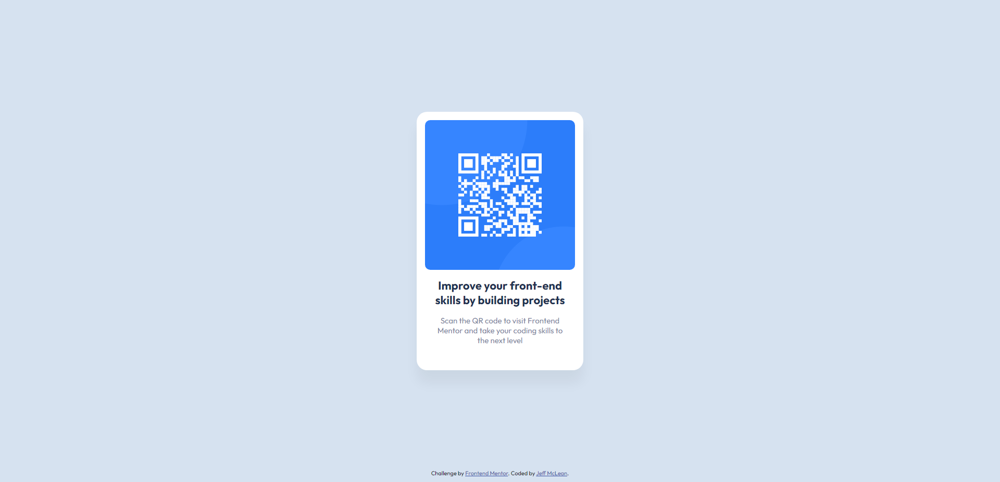

# Frontend Mentor - QR code component solution

This is a solution to the [QR code component challenge on Frontend Mentor](https://www.frontendmentor.io/challenges/qr-code-component-iux_sIO_H). Frontend Mentor challenges help you improve your coding skills by building realistic projects.

## Table of contents

- [Overview](#overview)
  - [Screenshot](#screenshot)
  - [Links](#links)
- [My process](#my-process)
  - [Built with](#built-with)
  - [What I learned](#what-i-learned)
  - [Continued development](#continued-development)
  - [Useful resources](#useful-resources)
- [Author](#author)
- [Acknowledgments](#acknowledgments)

## Overview

### Screenshot



### Links

- Live Solution URL: [Add solution URL here](https://jmmarketing.github.io/QR-Code-Component--FEM/)

## My process

### Built with

- HTML5
- CSS3
- Flexbox

### What I learned

Not so much learned, but it was good to refresh on how Flexbox worked. It is useful for aligning elements and responsiveness. Though this project didnt get to use its full capacity, it was a nice basic one to look back up.

Used it mostly on the card\_\_content class selector, see below:

```css
.card__content {
  display: flex;
  width: 288px;
  height: 129px;
  flex-direction: column;
  justify-content: center;
  align-items: center;
  gap: 16px;
  flex-shrink: 0;
  text-align: center;
  padding-top: 24px;
}
```

### Continued development

As mentioned above, I would like to continue exploring more advanced, nested, and responsive solutions using Flexbox. As well as work on understanding the more intermediate nuances of using it.

### Useful resources

- [Flexbox Froggy](https://flexboxfroggy.com/) - Great, simple, game to learn or review Flexbox. Worth adding to the bookmarks for future reference.

## Author

- Website - [Jeffrey McLean Marketing](https://www.jeffreymclean.com)
- Frontend Mentor - [@jmmarketing](https://www.frontendmentor.io/profile/jmmarketing)

## Acknowledgments

Shout out to Frontend Mentor for the challenges.
